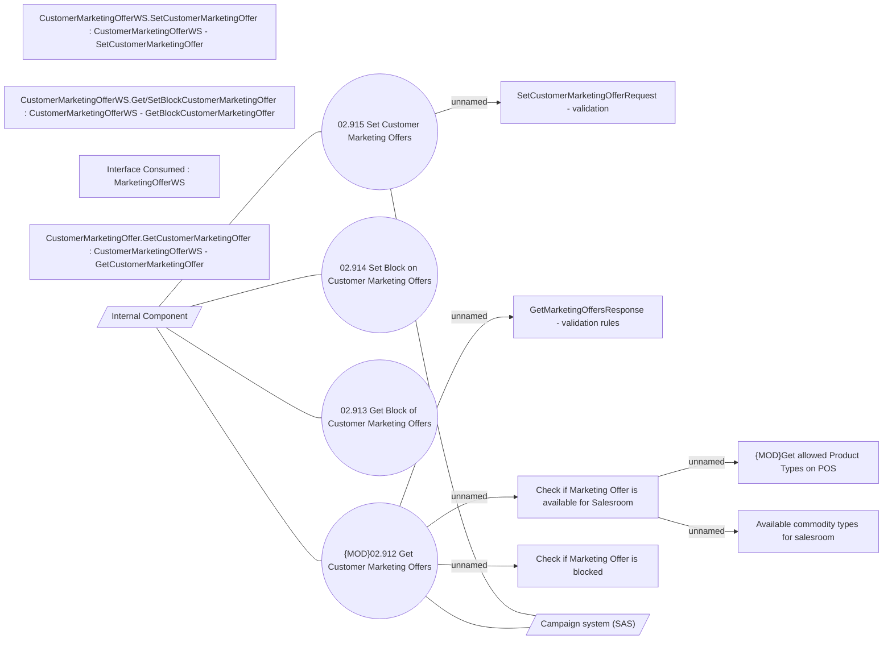

# Customer Marketing Offers

- **Diagram Type**: Use Case
- **Package**: HomerSelect/BSL/Modules/Marketing Offer/Analytical Model/Marketing Offers Data Source/Marketing Offers Data Source (common)/Use Case
- **Diagram ID**: 136920
- **Elements**: 17
- **Connectors**: 12

