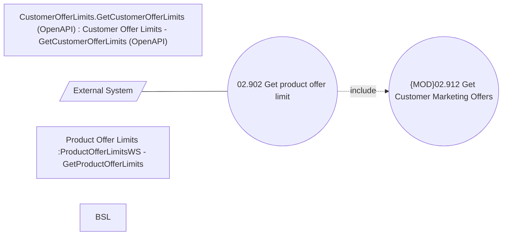

# Get product offer limits (ProductOfferLimitsWS + OpenAPI)

- **Diagram Type**: Use Case
- **Package**: HomerSelect/BSL/Modules/Marketing Offer/Analytical Model/Marketing Offers Data Source/Marketing Offers Data Source (common)/Use Case
- **Diagram ID**: 136919
- **Elements**: 6
- **Connectors**: 2

