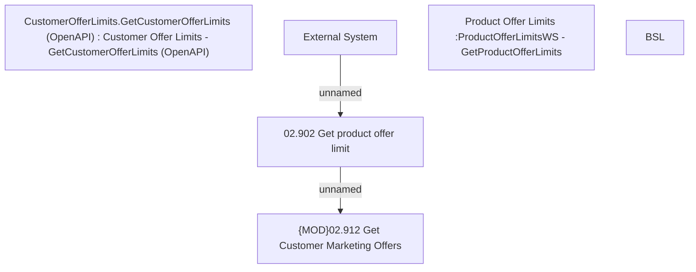

# Get product offer limits (ProductOfferLimitsWS + OpenAPI)

```mermaid
graph TD
    MOD_02_912_Get_Customer_Marketing_Offers["{MOD}02.912 Get Customer Marketing Offers"]
    CustomerOfferLimits_GetCustomerOfferLimits_OpenAPI_Customer_["CustomerOfferLimits.GetCustomerOfferLimits (OpenAPI) : Customer Offer Limits - GetCustomerOfferLimits (OpenAPI)"]
    External_System["External System"]
    Product_Offer_Limits_ProductOfferLimitsWS_GetProductOfferLim["Product Offer Limits :ProductOfferLimitsWS - GetProductOfferLimits"]
    n_02_902_Get_product_offer_limit["02.902 Get product offer limit"]
    BSL["BSL"]
    External_System -->|unnamed| n_02_902_Get_product_offer_limit
    n_02_902_Get_product_offer_limit -->|unnamed| MOD_02_912_Get_Customer_Marketing_Offers
```
