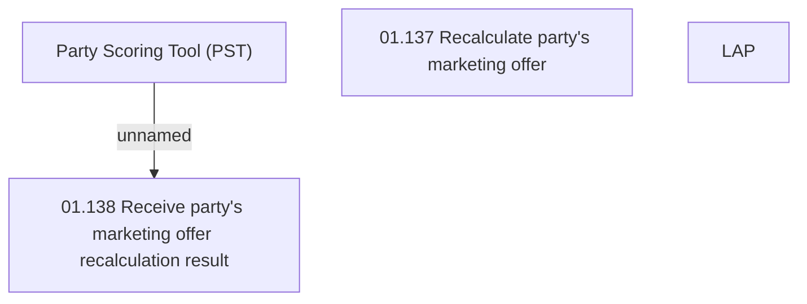

# Use Case

```mermaid
graph TD
    Party_Scoring_Tool_PST["Party Scoring Tool (PST)"]
    n_01_138_Receive_party_s_marketing_offer_recalculation_resul["01.138 Receive party's marketing offer recalculation result"]
    n_01_137_Recalculate_party_s_marketing_offer["01.137 Recalculate party's marketing offer"]
    LAP["LAP"]
    Party_Scoring_Tool_PST -->|unnamed| n_01_138_Receive_party_s_marketing_offer_recalculation_resul
```
