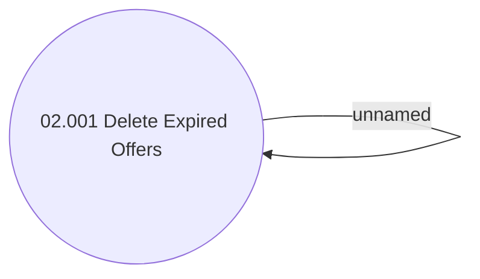

# Access Rights

- **Diagram Type**: Use Case
- **Package**: HomerSelect/BSL/Modules/Product Calculator/Analytical Model/Product Offer Repository/Access Rights
- **Diagram ID**: 99973
- **Elements**: 2
- **Connectors**: 1

