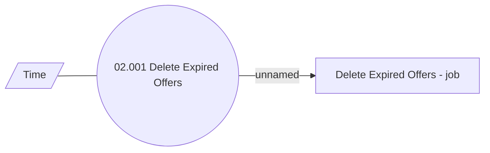

# Offer Repository Management

- **Diagram Type**: Use Case
- **Package**: HomerSelect/BSL/Modules/Product Calculator/Analytical Model/Product Offer Repository/Use Case
- **Diagram ID**: 99979
- **Elements**: 3
- **Connectors**: 2

