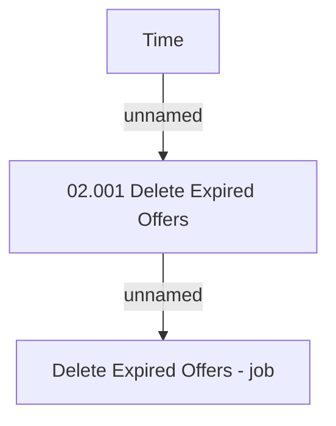

# Offer Repository Management

```mermaid
graph TD
    Delete_Expired_Offers_job["Delete Expired Offers - job"]
    Time["Time"]
    n_02_001_Delete_Expired_Offers["02.001 Delete Expired Offers"]
    Time -->|unnamed| n_02_001_Delete_Expired_Offers
    n_02_001_Delete_Expired_Offers -->|unnamed| Delete_Expired_Offers_job
```
