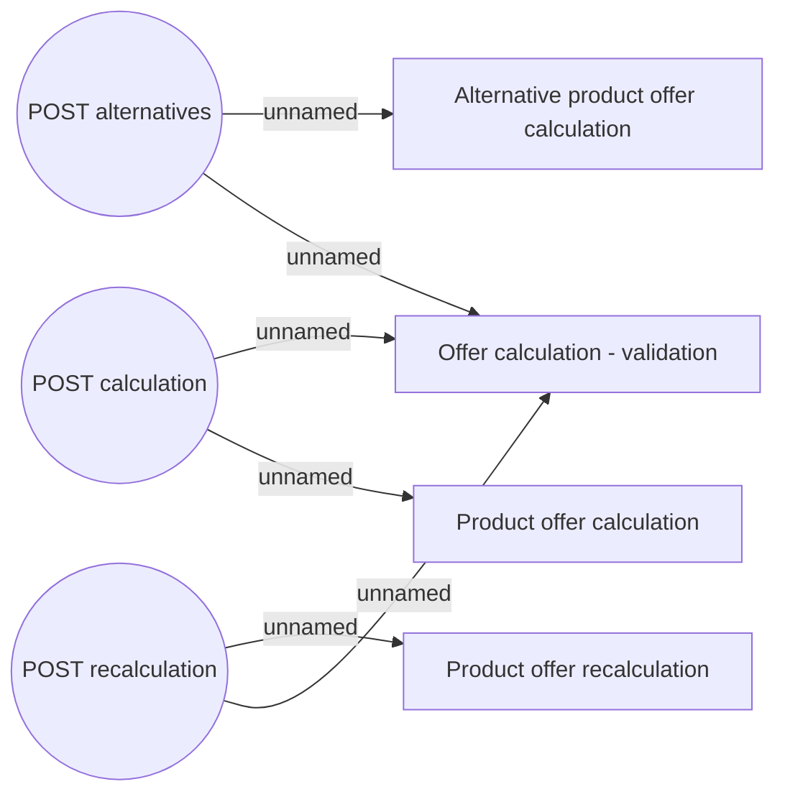

# Use Case

- **Diagram Type**: Use Case
- **Package**: HomerSelect/BSL/Modules/Product Calculator/Interface Provided/Product Calculator REST API/Product Calculator/Use Case
- **Diagram ID**: 158811
- **Elements**: 7
- **Connectors**: 6

