# Notification in Use Cases

- **Diagram Type**: Use Case
- **Package**: HomerSelect/BSL/Modules/Product Catalog (PRC)/Analytical Model/COMMON for Product Catalog/Notification
- **Diagram ID**: 162298
- **Elements**: 22
- **Connectors**: 21

```mermaid
graph LR
    n_04_406_Activate_Financing_Scheme_version_automatically(("04.406 Activate Financing Scheme version automatically"))
    n_04_416_Activate_Financing_Package_version_automatically(("04.416 Activate Financing Package version automatically"))
    n_04_190_Activate_Tariff_version_automatically(("04.190 Activate Tariff version automatically"))
    n_08_190_Activate_Service_version_automatically(("08.190 Activate Service version automatically"))
    n_02_262_Activate_product_version_automatically(("02.262 Activate product version automatically"))
    PUT_service(("PUT service"))
    POST_new_service(("POST new service"))
    PUT_product_profiles(("PUT product-profiles"))
    POST_product_profiles(("POST product-profiles"))
    PUT_financing_package(("PUT financing package"))
    POST_financing_package(("POST financing package"))
    PUT_financing_schemes(("PUT financing schemes"))
    POST_financing_schemes(("POST financing schemes"))
    MOD_PUT_tariffs(("{MOD}PUT tariffs"))
    MOD_POST_tariffs(("{MOD}POST tariffs"))
    MOD_PUT_services(("{MOD}PUT services"))
    MOD_POST_services(("{MOD}POST services"))
    MOD_PUT_products(("{MOD}PUT products"))
    MOD_POST_products(("{MOD}POST products"))
    PUT_manufacturers(("PUT manufacturers"))
    POST_manufacturers(("POST manufacturers"))
    Application_events["Application events"]
    n_04_190_Activate_Tariff_version_automatically -->|unnamed| Application_events
    n_02_262_Activate_product_version_automatically -->|unnamed| Application_events
    n_08_190_Activate_Service_version_automatically -->|unnamed| Application_events
    PUT_service -->|unnamed| Application_events
    POST_manufacturers -->|unnamed| Application_events
    POST_new_service -->|unnamed| Application_events
    PUT_product_profiles -->|unnamed| Application_events
    POST_product_profiles -->|unnamed| Application_events
    PUT_manufacturers -->|unnamed| Application_events
    PUT_financing_package -->|unnamed| Application_events
    POST_financing_package -->|unnamed| Application_events
    MOD_PUT_products -->|unnamed| Application_events
    MOD_POST_products -->|unnamed| Application_events
    MOD_POST_tariffs -->|unnamed| Application_events
    MOD_PUT_tariffs -->|unnamed| Application_events
    n_04_416_Activate_Financing_Package_version_automatically -->|unnamed| Application_events
    n_04_406_Activate_Financing_Scheme_version_automatically -->|unnamed| Application_events
    MOD_POST_services -->|unnamed| Application_events
    MOD_PUT_services -->|unnamed| Application_events
    PUT_financing_schemes -->|unnamed| Application_events
    POST_financing_schemes -->|unnamed| Application_events
```

