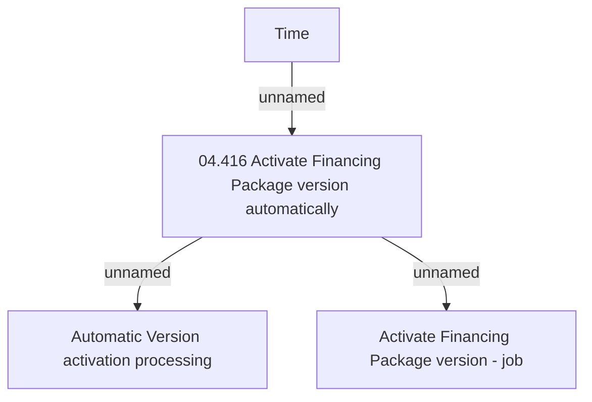

# Financing Package - job processing

```mermaid
graph TD
    Activate_Financing_Package_version_job["Activate Financing Package version - job"]
    n_04_416_Activate_Financing_Package_version_automatically["04.416 Activate Financing Package version automatically"]
    Time["Time"]
    Automatic_Version_activation_processing["Automatic Version activation processing"]
    n_04_416_Activate_Financing_Package_version_automatically -->|unnamed| Automatic_Version_activation_processing
    n_04_416_Activate_Financing_Package_version_automatically -->|unnamed| Activate_Financing_Package_version_job
    Time -->|unnamed| n_04_416_Activate_Financing_Package_version_automatically
```
