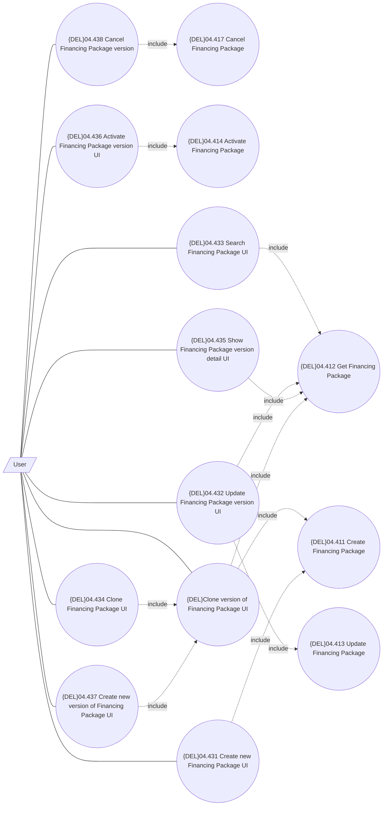

# UI for management of Financing Package

- **Diagram Type**: Use Case
- **Package**: HomerSelect/BSL/Modules/Product Catalog (PRC)/Analytical Model/Financing Scheme/Financing Package/UI for Financing Package Management/Use Case
- **Diagram ID**: 162295
- **Elements**: 15
- **Connectors**: 20

