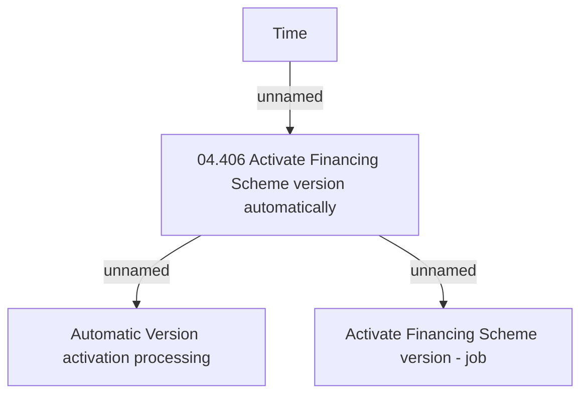

# Financing Scheme - job processing

```mermaid
graph TD
    Activate_Financing_Scheme_version_job["Activate Financing Scheme version - job"]
    n_04_406_Activate_Financing_Scheme_version_automatically["04.406 Activate Financing Scheme version automatically"]
    Time["Time"]
    Automatic_Version_activation_processing["Automatic Version activation processing"]
    n_04_406_Activate_Financing_Scheme_version_automatically -->|unnamed| Automatic_Version_activation_processing
    n_04_406_Activate_Financing_Scheme_version_automatically -->|unnamed| Activate_Financing_Scheme_version_job
    Time -->|unnamed| n_04_406_Activate_Financing_Scheme_version_automatically
```
