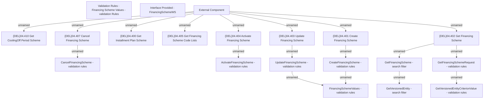

# Financing Scheme Management UC

```mermaid
graph TD
    DEL_04_410_Get_CoolingOff_Period_Scheme["{DEL}04.410 Get CoolingOff Period Scheme"]
    CancelFinancingScheme_validation_rules["CancelFinancingScheme - validation rules"]
    DEL_04_407_Cancel_Financing_Scheme["{DEL}04.407 Cancel Financing Scheme"]
    GetVersionedEntity_search_filter["GetVersionedEntity - search filter"]
    GetVersionedEntityCriterionValue_validation_rules["GetVersionedEntityCriterionValue - validation rules"]
    DEL_04_400_Get_Installment_Plan_Scheme["{DEL}04.400 Get Installment Plan Scheme"]
    Validation_Rules_Financing_Scheme_Values_validation_Rules["Validation Rules : Financing Scheme Values - validation Rules"]
    DEL_04_405_Get_Financing_Scheme_Code_Lists["{DEL}04.405 Get Financing Scheme Code Lists"]
    ActivateFinancingScheme_validation_rules["ActivateFinancingScheme - validation rules"]
    DEL_04_404_Activate_Financing_Scheme["{DEL}04.404 Activate Financing Scheme"]
    UpdateFinancingScheme_validation_rules["UpdateFinancingScheme - validation rules"]
    GetFinancingScheme_search_filter["GetFinancingScheme - search filter"]
    GetFinancingSchemeRequest_validation_rules["GetFinancingSchemeRequest - validation rules"]
    DEL_04_403_Update_Financing_Scheme["{DEL}04.403 Update Financing Scheme"]
    DEL_04_402_Get_Financing_Scheme["{DEL}04.402 Get Financing Scheme"]
    FinancingSchemeValues_validation_rules["FinancingSchemeValues - validation rules"]
    Interface_Provided_FinancingSchemeWS["Interface Provided : FinancingSchemeWS"]
    CreateFinancingScheme_validation_rules["CreateFinancingScheme - validation rules"]
    DEL_04_401_Create_Financing_Scheme["{DEL}04.401 Create Financing Scheme"]
    External_Component["External Component"]
    DEL_04_402_Get_Financing_Scheme -->|unnamed| GetFinancingScheme_search_filter
    GetFinancingScheme_search_filter -->|unnamed| GetVersionedEntity_search_filter
    GetFinancingSchemeRequest_validation_rules -->|unnamed| GetVersionedEntityCriterionValue_validation_rules
    DEL_04_404_Activate_Financing_Scheme -->|unnamed| ActivateFinancingScheme_validation_rules
    DEL_04_407_Cancel_Financing_Scheme -->|unnamed| CancelFinancingScheme_validation_rules
    DEL_04_403_Update_Financing_Scheme -->|unnamed| UpdateFinancingScheme_validation_rules
    DEL_04_402_Get_Financing_Scheme -->|unnamed| GetFinancingSchemeRequest_validation_rules
    UpdateFinancingScheme_validation_rules -->|unnamed| FinancingSchemeValues_validation_rules
    CreateFinancingScheme_validation_rules -->|unnamed| FinancingSchemeValues_validation_rules
    DEL_04_401_Create_Financing_Scheme -->|unnamed| CreateFinancingScheme_validation_rules
    External_Component -->|unnamed| DEL_04_400_Get_Installment_Plan_Scheme
    External_Component -->|unnamed| DEL_04_403_Update_Financing_Scheme
    External_Component -->|unnamed| DEL_04_407_Cancel_Financing_Scheme
    External_Component -->|unnamed| DEL_04_401_Create_Financing_Scheme
    External_Component -->|unnamed| DEL_04_405_Get_Financing_Scheme_Code_Lists
    External_Component -->|unnamed| DEL_04_410_Get_CoolingOff_Period_Scheme
    External_Component -->|unnamed| DEL_04_404_Activate_Financing_Scheme
    External_Component -->|unnamed| DEL_04_402_Get_Financing_Scheme
```
