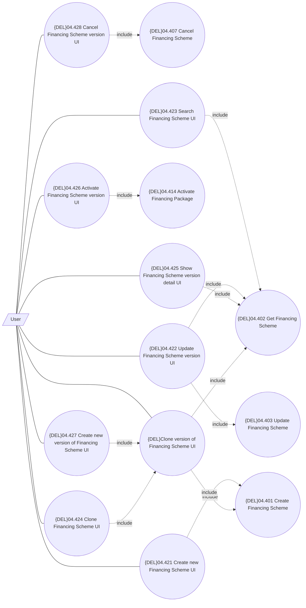

# UI for management of Financing Scheme

- **Diagram Type**: Use Case
- **Package**: HomerSelect/BSL/Modules/Product Catalog (PRC)/Analytical Model/Financing Scheme/Financing Scheme/UI for Financing Scheme Management/Use Case
- **Diagram ID**: 162357
- **Elements**: 15
- **Connectors**: 20

