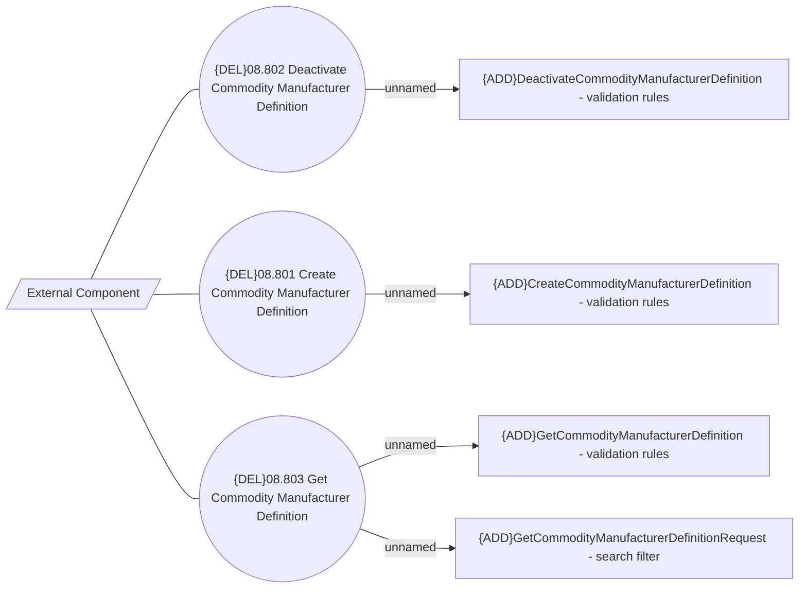

# Commodity Manufacturer Definition UC

- **Diagram Type**: Use Case
- **Package**: HomerSelect/BSL/Modules/Product Catalog (PRC)/Analytical Model/Model mapper/Use Case
- **Diagram ID**: 162656
- **Elements**: 8
- **Connectors**: 7

