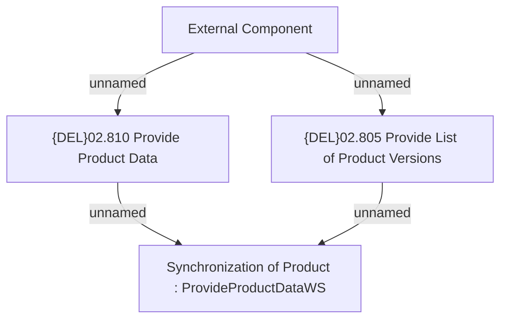

# ProvideProductDataWS

```mermaid
graph TD
    External_Component["External Component"]
    Synchronization_of_Product_ProvideProductDataWS["Synchronization of Product : ProvideProductDataWS"]
    DEL_02_805_Provide_List_of_Product_Versions["{DEL}02.805 Provide List of Product Versions"]
    DEL_02_810_Provide_Product_Data["{DEL}02.810 Provide Product Data"]
    DEL_02_810_Provide_Product_Data -->|unnamed| Synchronization_of_Product_ProvideProductDataWS
    DEL_02_805_Provide_List_of_Product_Versions -->|unnamed| Synchronization_of_Product_ProvideProductDataWS
    External_Component -->|unnamed| DEL_02_810_Provide_Product_Data
    External_Component -->|unnamed| DEL_02_805_Provide_List_of_Product_Versions
```
