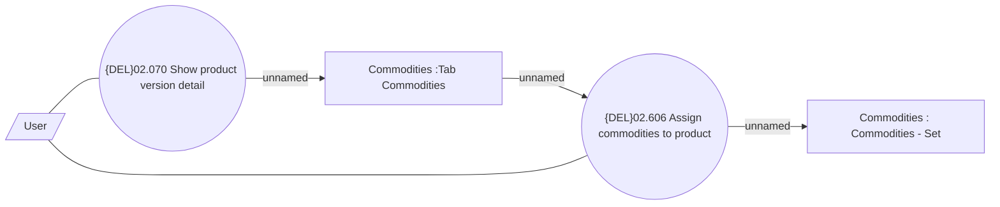

# Assign Commodities

- **Diagram Type**: Use Case
- **Package**: HomerSelect/BSL/Modules/Product Catalog (PRC)/Analytical Model/Product/User Interface for Product Management/Commodities Assignment/Use Case 
- **Diagram ID**: 162492
- **Elements**: 5
- **Connectors**: 5

