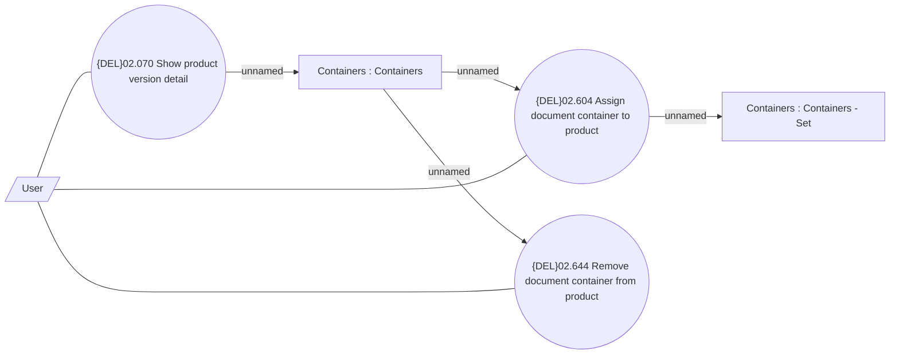

# Assign Document Container

- **Diagram Type**: Use Case
- **Package**: HomerSelect/BSL/Modules/Product Catalog (PRC)/Analytical Model/Product/User Interface for Product Management/Document Container Assignment/Use Case
- **Diagram ID**: 162479
- **Elements**: 6
- **Connectors**: 7

