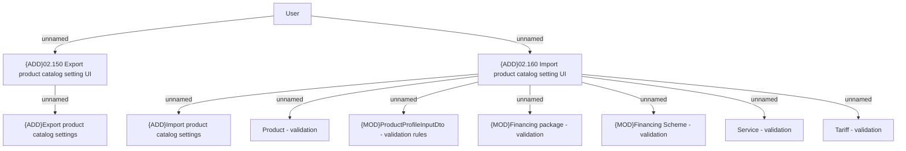

# Export/Import product setting

```mermaid
graph TD
    ADD_Import_product_catalog_settings["{ADD}Import product catalog settings"]
    ADD_Export_product_catalog_settings["{ADD}Export product catalog settings"]
    User["User"]
    Product_validation["Product - validation"]
    MOD_ProductProfileInputDto_validation_rules["{MOD}ProductProfileInputDto - validation rules"]
    MOD_Financing_package_validation["{MOD}Financing package - validation"]
    MOD_Financing_Scheme_validation["{MOD}Financing Scheme - validation"]
    Service_validation["Service - validation"]
    Tariff_validation["Tariff - validation"]
    ADD_02_150_Export_product_catalog_setting_UI["{ADD}02.150 Export product catalog setting UI"]
    ADD_02_160_Import_product_catalog_setting_UI["{ADD}02.160 Import product catalog setting UI"]
    ADD_02_160_Import_product_catalog_setting_UI -->|unnamed| ADD_Import_product_catalog_settings
    ADD_02_150_Export_product_catalog_setting_UI -->|unnamed| ADD_Export_product_catalog_settings
    ADD_02_160_Import_product_catalog_setting_UI -->|unnamed| Product_validation
    ADD_02_160_Import_product_catalog_setting_UI -->|unnamed| MOD_ProductProfileInputDto_validation_rules
    ADD_02_160_Import_product_catalog_setting_UI -->|unnamed| MOD_Financing_package_validation
    ADD_02_160_Import_product_catalog_setting_UI -->|unnamed| MOD_Financing_Scheme_validation
    ADD_02_160_Import_product_catalog_setting_UI -->|unnamed| Service_validation
    ADD_02_160_Import_product_catalog_setting_UI -->|unnamed| Tariff_validation
    User -->|unnamed| ADD_02_150_Export_product_catalog_setting_UI
    User -->|unnamed| ADD_02_160_Import_product_catalog_setting_UI
```
