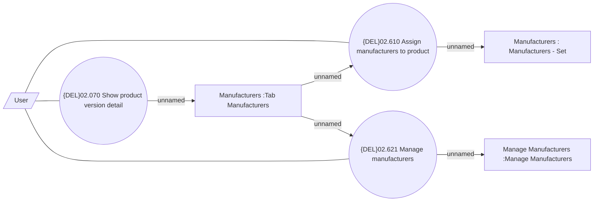

# Manage and Assign Manufacturer

- **Diagram Type**: Use Case
- **Package**: HomerSelect/BSL/Modules/Product Catalog (PRC)/Analytical Model/Product/User Interface for Product Management/Manufacturer Management and Assignment/Use Case
- **Diagram ID**: 162481
- **Elements**: 7
- **Connectors**: 8

