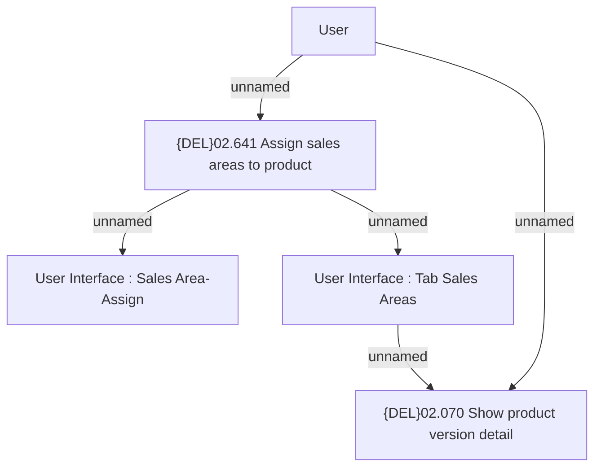

# Assign Product Sales Area

```mermaid
graph TD
    User["User"]
    DEL_02_641_Assign_sales_areas_to_product["{DEL}02.641 Assign sales areas to product"]
    User_Interface_Sales_Area_Assign["User Interface : Sales Area-Assign"]
    User_Interface_Tab_Sales_Areas["User Interface : Tab Sales Areas"]
    DEL_02_070_Show_product_version_detail["{DEL}02.070 Show product version detail"]
    User_Interface_Tab_Sales_Areas -->|unnamed| DEL_02_070_Show_product_version_detail
    DEL_02_641_Assign_sales_areas_to_product -->|unnamed| User_Interface_Tab_Sales_Areas
    DEL_02_641_Assign_sales_areas_to_product -->|unnamed| User_Interface_Sales_Area_Assign
    User -->|unnamed| DEL_02_641_Assign_sales_areas_to_product
    User -->|unnamed| DEL_02_070_Show_product_version_detail
```
