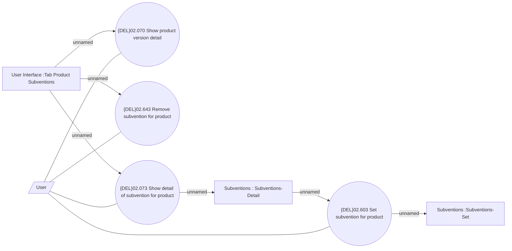

# Manage Product Subvention

- **Diagram Type**: Use Case
- **Package**: HomerSelect/BSL/Modules/Product Catalog (PRC)/Analytical Model/Product/User Interface for Product Management/Product Subvention/Use Case
- **Diagram ID**: 162490
- **Elements**: 8
- **Connectors**: 10

