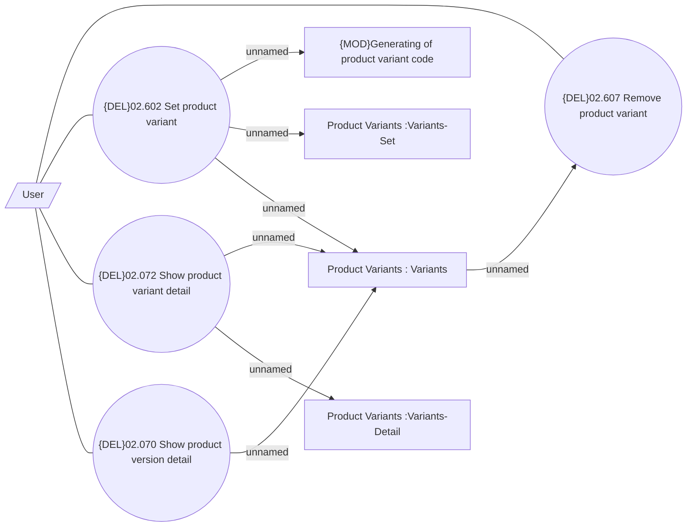

# Manage Product Variant

- **Diagram Type**: Use Case
- **Package**: HomerSelect/BSL/Modules/Product Catalog (PRC)/Analytical Model/Product/User Interface for Product Management/Product Variant/Use Case
- **Diagram ID**: 162478
- **Elements**: 9
- **Connectors**: 11

