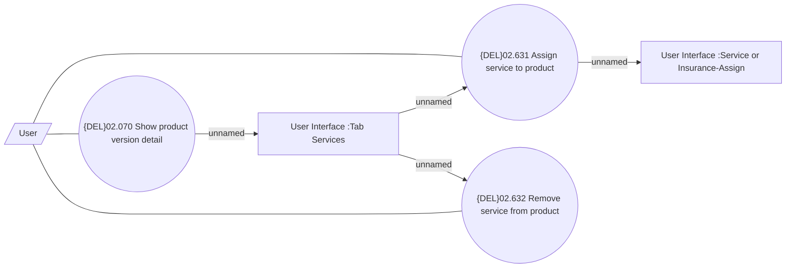

# Assign Service

- **Diagram Type**: Use Case
- **Package**: HomerSelect/BSL/Modules/Product Catalog (PRC)/Analytical Model/Product/User Interface for Product Management/Service Assignment/Use Case
- **Diagram ID**: 162483
- **Elements**: 6
- **Connectors**: 7

