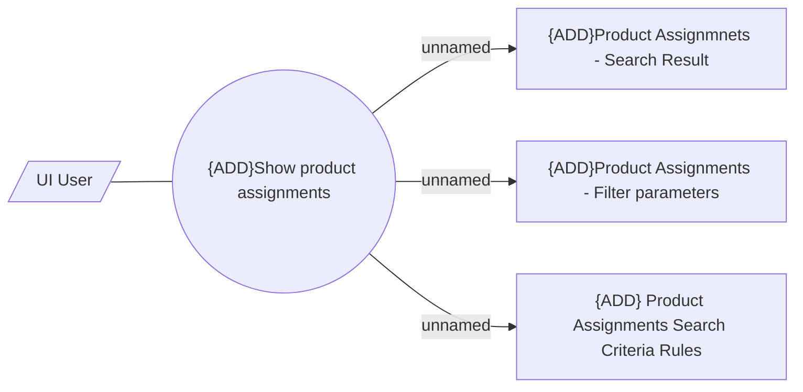

# UI - Product Assignments Governance

- **Diagram Type**: Use Case
- **Package**: HomerSelect/BSL/Modules/Product Catalog (PRC)/Analytical Model/Salesroom/User Interface/Use Case
- **Diagram ID**: 163913
- **Elements**: 5
- **Connectors**: 4

