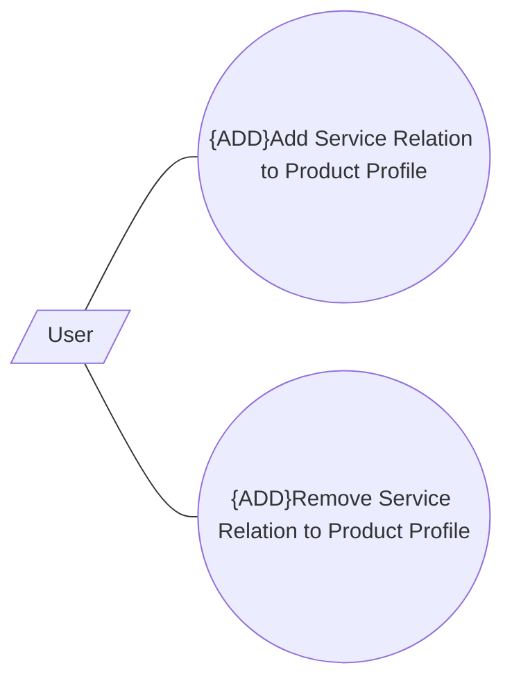

# Use Case

- **Diagram Type**: Use Case
- **Package**: HomerSelect/BSL/Modules/Product Catalog (PRC)/Analytical Model/Service to Product profile/COMMON for Service to Product profile/Use Case
- **Diagram ID**: 163160
- **Elements**: 3
- **Connectors**: 2

