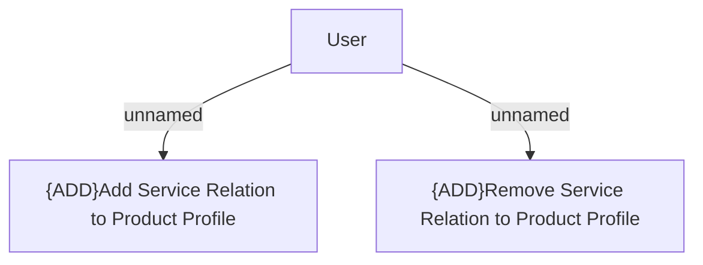

# Use Case

```mermaid
graph TD
    User["User"]
    ADD_Remove_Service_Relation_to_Product_Profile["{ADD}Remove Service Relation to Product Profile"]
    ADD_Add_Service_Relation_to_Product_Profile["{ADD}Add Service Relation to Product Profile"]
    User -->|unnamed| ADD_Add_Service_Relation_to_Product_Profile
    User -->|unnamed| ADD_Remove_Service_Relation_to_Product_Profile
```
