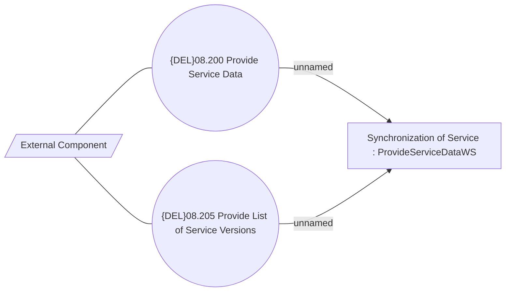

# ProvideServiceDataWS

- **Diagram Type**: Use Case
- **Package**: HomerSelect/BSL/Modules/Product Catalog (PRC)/Analytical Model/Service/Provided Services/Use case
- **Diagram ID**: 162661
- **Elements**: 4
- **Connectors**: 4

