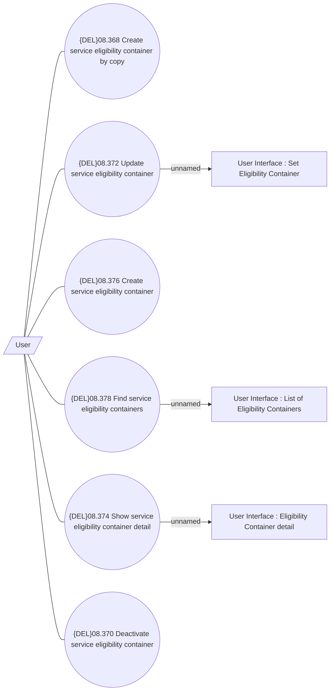

# Manage Eligibility Container

- **Diagram Type**: Use Case
- **Package**: HomerSelect/BSL/Modules/Product Catalog (PRC)/Analytical Model/Service/Service Eligibility Management/Use Case
- **Diagram ID**: 162649
- **Elements**: 10
- **Connectors**: 9

