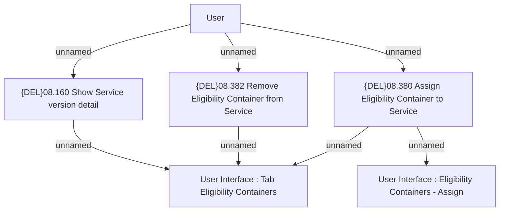

# Assignment of Eligibility Container to Service

```mermaid
graph TD
    User["User"]
    User_Interface_Tab_Eligibility_Containers["User Interface : Tab Eligibility Containers"]
    User_Interface_Eligibility_Containers_Assign["User Interface : Eligibility Containers - Assign"]
    DEL_08_382_Remove_Eligibility_Container_from_Service["{DEL}08.382 Remove Eligibility Container from Service"]
    DEL_08_380_Assign_Eligibility_Container_to_Service["{DEL}08.380 Assign Eligibility Container to Service"]
    DEL_08_160_Show_Service_version_detail["{DEL}08.160 Show Service version detail"]
    DEL_08_380_Assign_Eligibility_Container_to_Service -->|unnamed| User_Interface_Eligibility_Containers_Assign
    DEL_08_160_Show_Service_version_detail -->|unnamed| User_Interface_Tab_Eligibility_Containers
    DEL_08_382_Remove_Eligibility_Container_from_Service -->|unnamed| User_Interface_Tab_Eligibility_Containers
    DEL_08_380_Assign_Eligibility_Container_to_Service -->|unnamed| User_Interface_Tab_Eligibility_Containers
    User -->|unnamed| DEL_08_160_Show_Service_version_detail
    User -->|unnamed| DEL_08_380_Assign_Eligibility_Container_to_Service
    User -->|unnamed| DEL_08_382_Remove_Eligibility_Container_from_Service
```
