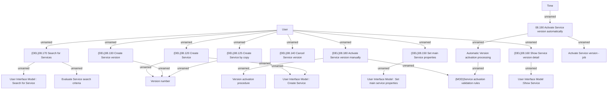

# Manage Services

```mermaid
graph TD
    Time["Time"]
    User["User"]
    User_Interface_Model_Search_for_Service["User Interface Model : Search for Service"]
    User_Interface_Model_Set_main_service_properties["User Interface Model : Set main service properties"]
    User_Interface_Model_Create_Service["User Interface Model : Create Service"]
    User_Interface_Model_Show_Service["User Interface Model :Show Service"]
    Automatic_Version_activation_processing["Automatic Version activation processing"]
    Version_activation_procedure["Version activation procedure"]
    MOD_Service_activation_validation_rules["{MOD}Service activation validation rules"]
    Evaluate_Service_search_criteria["Evaluate Service search criteria"]
    n_08_190_Activate_Service_version_automatically["08.190 Activate Service version automatically"]
    DEL_08_180_Activate_Service_version_manually["{DEL}08.180 Activate Service version manually"]
    DEL_08_170_Search_for_Services["{DEL}08.170 Search for Services"]
    DEL_08_150_Set_main_Service_properties["{DEL}08.150 Set main Service properties"]
    DEL_08_140_Cancel_Service_version["{DEL}08.140 Cancel Service version"]
    DEL_08_130_Create_Service_version["{DEL}08.130 Create Service version"]
    DEL_08_125_Create_Service_by_copy["{DEL}08.125 Create Service by copy"]
    DEL_08_120_Create_Service["{DEL}08.120 Create Service"]
    DEL_08_160_Show_Service_version_detail["{DEL}08.160 Show Service version detail"]
    Version_number["Version number"]
    Activate_Service_version_job["Activate Service version - job"]
    DEL_08_150_Set_main_Service_properties -->|unnamed| User_Interface_Model_Set_main_service_properties
    DEL_08_125_Create_Service_by_copy -->|unnamed| User_Interface_Model_Create_Service
    DEL_08_120_Create_Service -->|unnamed| User_Interface_Model_Create_Service
    DEL_08_160_Show_Service_version_detail -->|unnamed| User_Interface_Model_Show_Service
    n_08_190_Activate_Service_version_automatically -->|unnamed| Automatic_Version_activation_processing
    DEL_08_180_Activate_Service_version_manually -->|unnamed| Version_activation_procedure
    DEL_08_180_Activate_Service_version_manually -->|unnamed| MOD_Service_activation_validation_rules
    Automatic_Version_activation_processing -->|unnamed| MOD_Service_activation_validation_rules
    DEL_08_170_Search_for_Services -->|unnamed| Evaluate_Service_search_criteria
    DEL_08_170_Search_for_Services -->|unnamed| User_Interface_Model_Search_for_Service
    n_08_190_Activate_Service_version_automatically -->|unnamed| Activate_Service_version_job
    DEL_08_120_Create_Service -->|unnamed| Version_number
    DEL_08_130_Create_Service_version -->|unnamed| Version_number
    DEL_08_125_Create_Service_by_copy -->|unnamed| Version_number
    Time -->|unnamed| n_08_190_Activate_Service_version_automatically
    User -->|unnamed| DEL_08_125_Create_Service_by_copy
    User -->|unnamed| DEL_08_160_Show_Service_version_detail
    User -->|unnamed| DEL_08_150_Set_main_Service_properties
    User -->|unnamed| DEL_08_130_Create_Service_version
    User -->|unnamed| DEL_08_180_Activate_Service_version_manually
    User -->|unnamed| DEL_08_170_Search_for_Services
    User -->|unnamed| DEL_08_140_Cancel_Service_version
    User -->|unnamed| DEL_08_120_Create_Service
```
