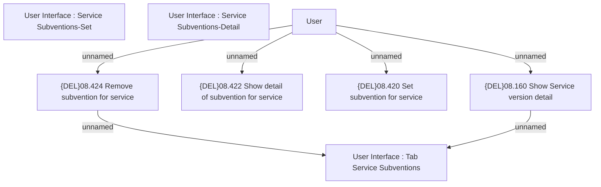

# Manage Service Subvention

```mermaid
graph TD
    User_Interface_Service_Subventions_Set["User Interface : Service Subventions-Set"]
    User_Interface_Service_Subventions_Detail["User Interface : Service Subventions-Detail"]
    User_Interface_Tab_Service_Subventions["User Interface : Tab Service Subventions"]
    DEL_08_424_Remove_subvention_for_service["{DEL}08.424 Remove subvention for service"]
    DEL_08_422_Show_detail_of_subvention_for_service["{DEL}08.422 Show detail of subvention for service"]
    DEL_08_420_Set_subvention_for_service["{DEL}08.420 Set subvention for service"]
    DEL_08_160_Show_Service_version_detail["{DEL}08.160 Show Service version detail"]
    User["User"]
    DEL_08_424_Remove_subvention_for_service -->|unnamed| User_Interface_Tab_Service_Subventions
    DEL_08_160_Show_Service_version_detail -->|unnamed| User_Interface_Tab_Service_Subventions
    User -->|unnamed| DEL_08_160_Show_Service_version_detail
    User -->|unnamed| DEL_08_420_Set_subvention_for_service
    User -->|unnamed| DEL_08_422_Show_detail_of_subvention_for_service
    User -->|unnamed| DEL_08_424_Remove_subvention_for_service
```
