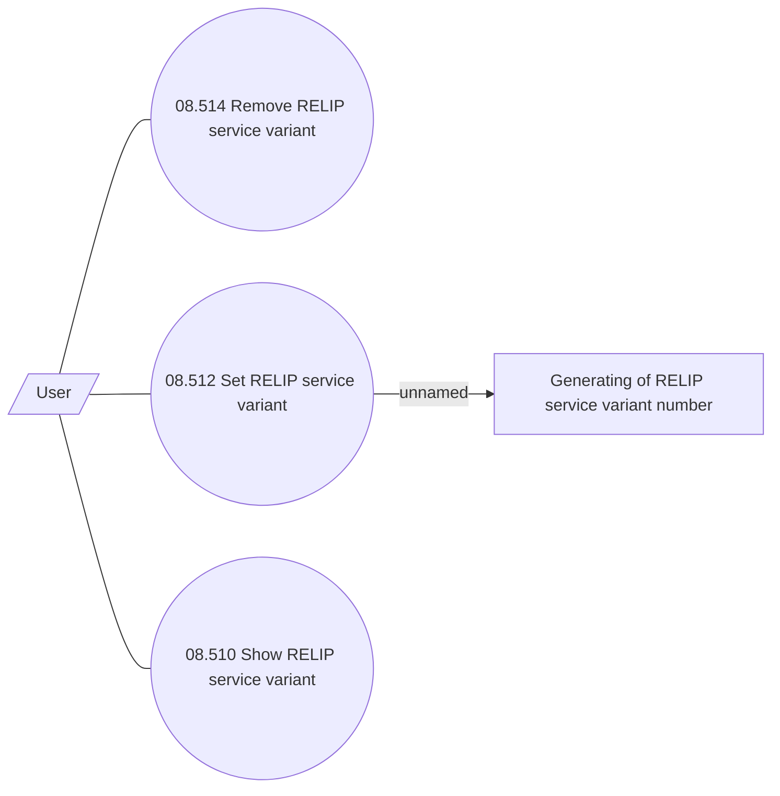

# Manage service REL transaction Installment Plan

- **Diagram Type**: Use Case
- **Package**: HomerSelect/BSL/Modules/Product Catalog (PRC)/Analytical Model/Service/User Interface for Service Management/Service Type Specific Extension/RELIP/Use Case
- **Diagram ID**: 70488
- **Elements**: 5
- **Connectors**: 4

