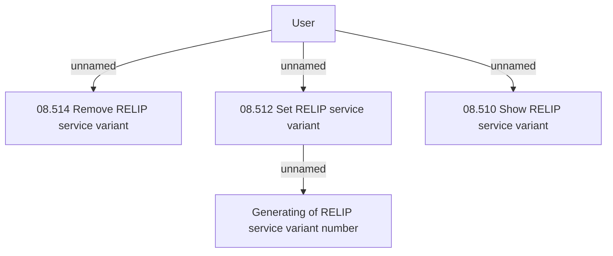

# Manage service REL transaction Installment Plan

```mermaid
graph TD
    Generating_of_RELIP_service_variant_number["Generating of RELIP service variant number"]
    n_08_514_Remove_RELIP_service_variant["08.514 Remove RELIP service variant"]
    n_08_512_Set_RELIP_service_variant["08.512 Set RELIP service variant"]
    n_08_510_Show_RELIP_service_variant["08.510 Show RELIP service variant"]
    User["User"]
    n_08_512_Set_RELIP_service_variant -->|unnamed| Generating_of_RELIP_service_variant_number
    User -->|unnamed| n_08_512_Set_RELIP_service_variant
    User -->|unnamed| n_08_514_Remove_RELIP_service_variant
    User -->|unnamed| n_08_510_Show_RELIP_service_variant
```
