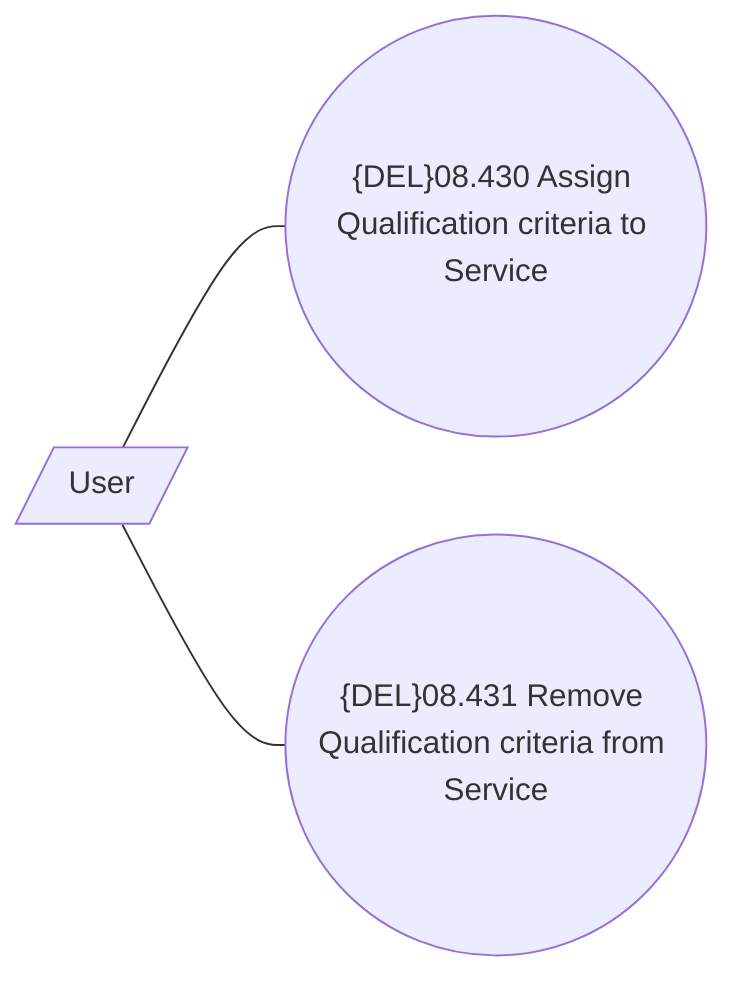

# Assignment of Qualification criteria to Service

- **Diagram Type**: Use Case
- **Package**: HomerSelect/BSL/Modules/Product Catalog (PRC)/Analytical Model/Service/User Interface for Service Management/{ADD}Qualification criteria/Use Case
- **Diagram ID**: 162659
- **Elements**: 3
- **Connectors**: 2

