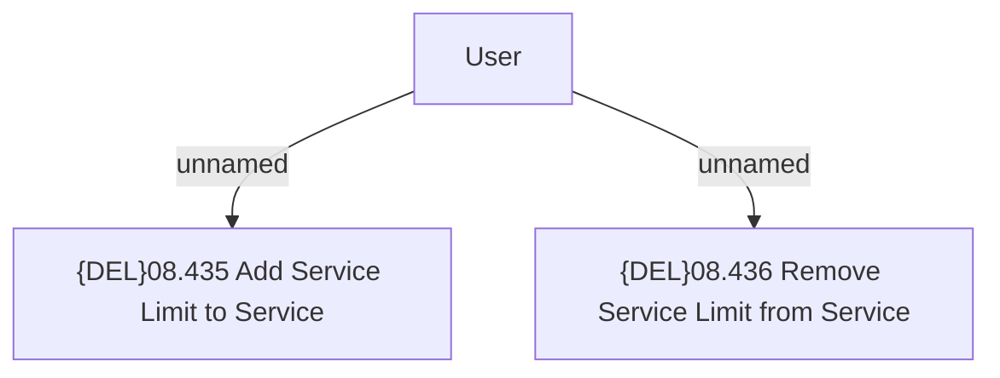

# Use Case

```mermaid
graph TD
    DEL_08_436_Remove_Service_Limit_from_Service["{DEL}08.436 Remove Service Limit from Service"]
    User["User"]
    DEL_08_435_Add_Service_Limit_to_Service["{DEL}08.435 Add Service Limit to Service"]
    User -->|unnamed| DEL_08_435_Add_Service_Limit_to_Service
    User -->|unnamed| DEL_08_436_Remove_Service_Limit_from_Service
```
