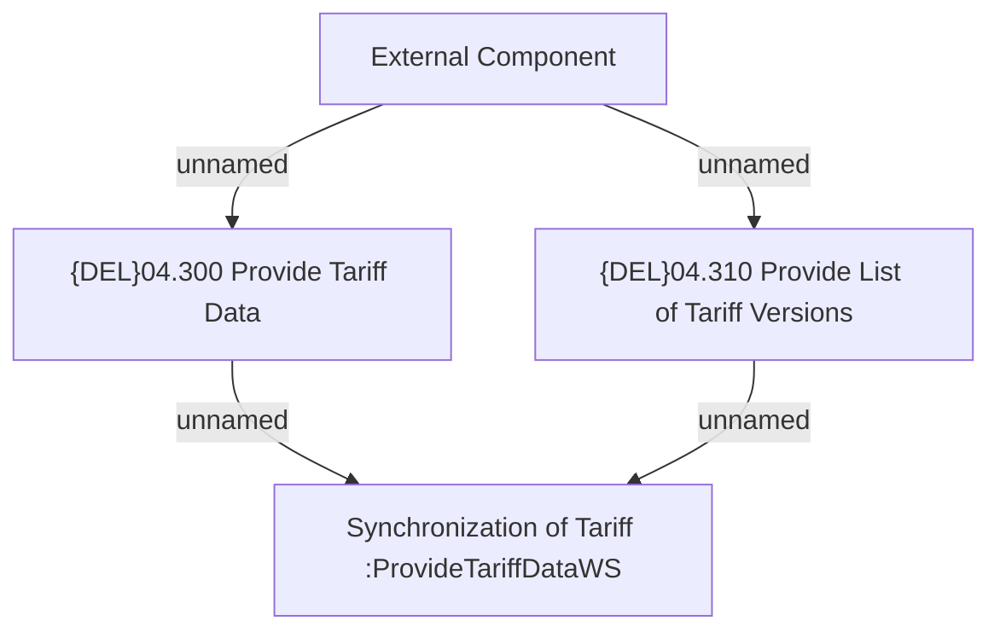

# ProvideServiceDataWS

```mermaid
graph TD
    External_Component["External Component"]
    Synchronization_of_Tariff_ProvideTariffDataWS["Synchronization of Tariff :ProvideTariffDataWS"]
    DEL_04_310_Provide_List_of_Tariff_Versions["{DEL}04.310 Provide List of Tariff Versions"]
    DEL_04_300_Provide_Tariff_Data["{DEL}04.300 Provide Tariff Data"]
    DEL_04_300_Provide_Tariff_Data -->|unnamed| Synchronization_of_Tariff_ProvideTariffDataWS
    DEL_04_310_Provide_List_of_Tariff_Versions -->|unnamed| Synchronization_of_Tariff_ProvideTariffDataWS
    External_Component -->|unnamed| DEL_04_300_Provide_Tariff_Data
    External_Component -->|unnamed| DEL_04_310_Provide_List_of_Tariff_Versions
```
