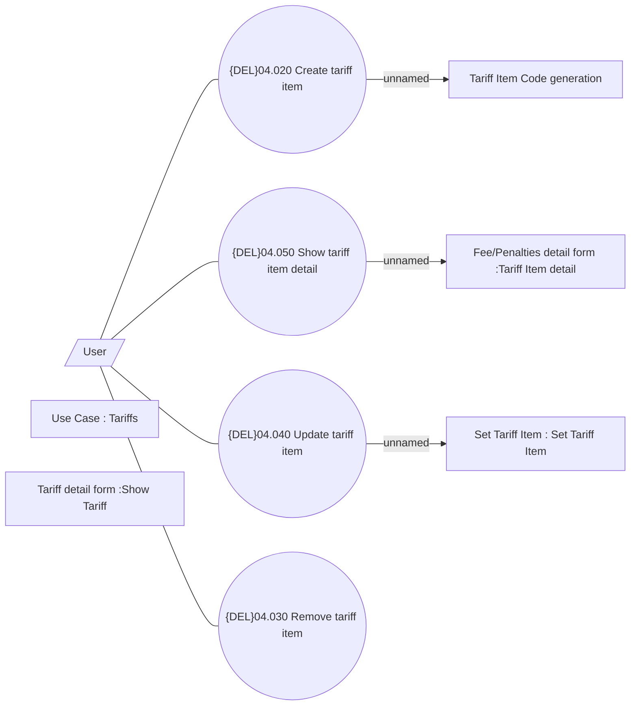

# Tariff Items

- **Diagram Type**: Use Case
- **Package**: HomerSelect/BSL/Modules/Product Catalog (PRC)/Analytical Model/Tariff/User Interface for Tariff Management/Tariff Item/Use Case
- **Diagram ID**: 162786
- **Elements**: 10
- **Connectors**: 7

