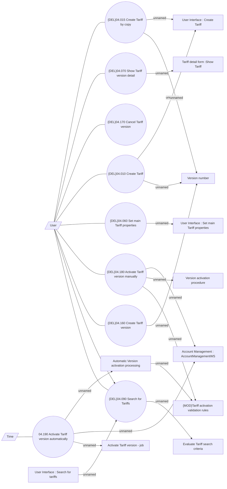

# Tariffs

- **Diagram Type**: Use Case
- **Package**: HomerSelect/BSL/Modules/Product Catalog (PRC)/Analytical Model/Tariff/User Interface for Tariff Management/Tariff Root/Use Case
- **Diagram ID**: 162289
- **Elements**: 22
- **Connectors**: 26

