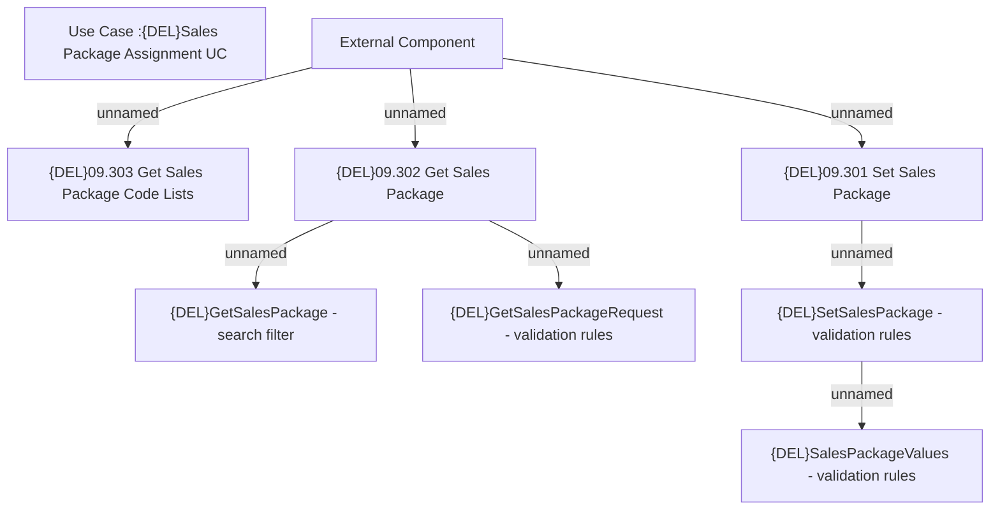

# {DEL}Sales Package UC

```mermaid
graph TD
    Use_Case_DEL_Sales_Package_Assignment_UC["Use Case :{DEL}Sales Package Assignment UC"]
    DEL_GetSalesPackage_search_filter["{DEL}GetSalesPackage - search filter"]
    DEL_GetSalesPackageRequest_validation_rules["{DEL}GetSalesPackageRequest - validation rules"]
    DEL_SalesPackageValues_validation_rules["{DEL}SalesPackageValues - validation rules"]
    DEL_SetSalesPackage_validation_rules["{DEL}SetSalesPackage - validation rules"]
    DEL_09_303_Get_Sales_Package_Code_Lists["{DEL}09.303 Get Sales Package Code Lists"]
    DEL_09_302_Get_Sales_Package["{DEL}09.302 Get Sales Package"]
    DEL_09_301_Set_Sales_Package["{DEL}09.301 Set Sales Package"]
    External_Component["External Component"]
    DEL_09_301_Set_Sales_Package -->|unnamed| DEL_SetSalesPackage_validation_rules
    DEL_09_302_Get_Sales_Package -->|unnamed| DEL_GetSalesPackageRequest_validation_rules
    DEL_09_302_Get_Sales_Package -->|unnamed| DEL_GetSalesPackage_search_filter
    DEL_SetSalesPackage_validation_rules -->|unnamed| DEL_SalesPackageValues_validation_rules
    External_Component -->|unnamed| DEL_09_303_Get_Sales_Package_Code_Lists
    External_Component -->|unnamed| DEL_09_301_Set_Sales_Package
    External_Component -->|unnamed| DEL_09_302_Get_Sales_Package
```
