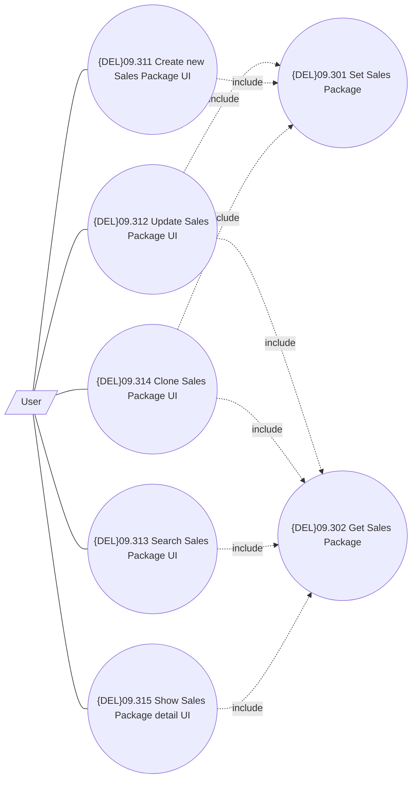

# UI for management of Sales Package

- **Diagram Type**: Use Case
- **Package**: HomerSelect/BSL/Modules/Product Catalog (PRC)/Analytical Model/{ADD}Sales Package/UI for Sales Package Management/Use Case
- **Diagram ID**: 162654
- **Elements**: 8
- **Connectors**: 12

