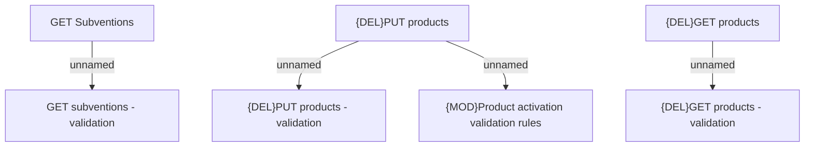

# Use case

```mermaid
graph TD
    GET_subventions_validation["GET subventions - validation"]
    GET_Subventions["GET Subventions"]
    MOD_Product_activation_validation_rules["{MOD}Product activation validation rules"]
    DEL_PUT_products_validation["{DEL}PUT products - validation"]
    DEL_GET_products_validation["{DEL}GET products - validation"]
    DEL_PUT_products["{DEL}PUT products"]
    DEL_GET_products["{DEL}GET products"]
    DEL_GET_products -->|unnamed| DEL_GET_products_validation
    DEL_PUT_products -->|unnamed| DEL_PUT_products_validation
    DEL_PUT_products -->|unnamed| MOD_Product_activation_validation_rules
    GET_Subventions -->|unnamed| GET_subventions_validation
```
