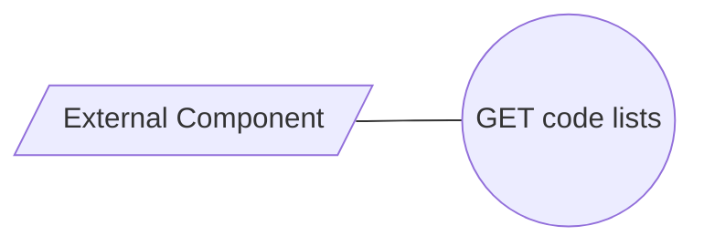

# Use Case

- **Diagram Type**: Use Case
- **Package**: HomerSelect/BSL/Modules/Product Catalog (PRC)/Interface Provided/Product Catalog REST API/Code Lists/Use Case
- **Diagram ID**: 159573
- **Elements**: 2
- **Connectors**: 1

