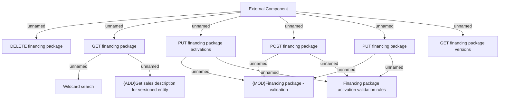

# Use Case

```mermaid
graph TD
    ADD_Get_sales_description_for_versioned_entity["{ADD}Get sales description for versioned entity"]
    Wildcard_search["Wildcard search"]
    Financing_package_activation_validation_rules["Financing package activation validation rules"]
    PUT_financing_package_activations["PUT financing package activations"]
    MOD_Financing_package_validation["{MOD}Financing package - validation"]
    External_Component["External Component"]
    GET_financing_package_versions["GET financing package versions"]
    DELETE_financing_package["DELETE financing package"]
    PUT_financing_package["PUT financing package"]
    POST_financing_package["POST financing package"]
    GET_financing_package["GET financing package"]
    PUT_financing_package -->|unnamed| MOD_Financing_package_validation
    POST_financing_package -->|unnamed| MOD_Financing_package_validation
    PUT_financing_package_activations -->|unnamed| MOD_Financing_package_validation
    PUT_financing_package_activations -->|unnamed| Financing_package_activation_validation_rules
    PUT_financing_package -->|unnamed| Financing_package_activation_validation_rules
    POST_financing_package -->|unnamed| Financing_package_activation_validation_rules
    GET_financing_package -->|unnamed| Wildcard_search
    GET_financing_package -->|unnamed| ADD_Get_sales_description_for_versioned_entity
    External_Component -->|unnamed| DELETE_financing_package
    External_Component -->|unnamed| GET_financing_package
    External_Component -->|unnamed| PUT_financing_package_activations
    External_Component -->|unnamed| POST_financing_package
    External_Component -->|unnamed| PUT_financing_package
    External_Component -->|unnamed| GET_financing_package_versions
```
