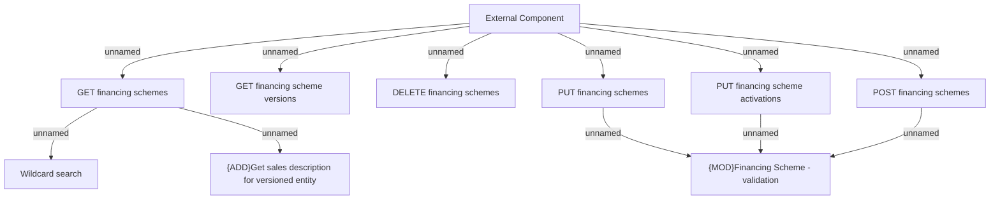

# Use Case

```mermaid
graph TD
    ADD_Get_sales_description_for_versioned_entity["{ADD}Get sales description for versioned entity"]
    Wildcard_search["Wildcard search"]
    PUT_financing_scheme_activations["PUT financing scheme activations"]
    External_Component["External Component"]
    GET_financing_scheme_versions["GET financing scheme versions"]
    DELETE_financing_schemes["DELETE financing schemes"]
    PUT_financing_schemes["PUT financing schemes"]
    MOD_Financing_Scheme_validation["{MOD}Financing Scheme - validation"]
    POST_financing_schemes["POST financing schemes"]
    GET_financing_schemes["GET financing schemes"]
    PUT_financing_schemes -->|unnamed| MOD_Financing_Scheme_validation
    PUT_financing_scheme_activations -->|unnamed| MOD_Financing_Scheme_validation
    POST_financing_schemes -->|unnamed| MOD_Financing_Scheme_validation
    GET_financing_schemes -->|unnamed| Wildcard_search
    GET_financing_schemes -->|unnamed| ADD_Get_sales_description_for_versioned_entity
    External_Component -->|unnamed| GET_financing_schemes
    External_Component -->|unnamed| DELETE_financing_schemes
    External_Component -->|unnamed| GET_financing_scheme_versions
    External_Component -->|unnamed| PUT_financing_schemes
    External_Component -->|unnamed| PUT_financing_scheme_activations
    External_Component -->|unnamed| POST_financing_schemes
```
