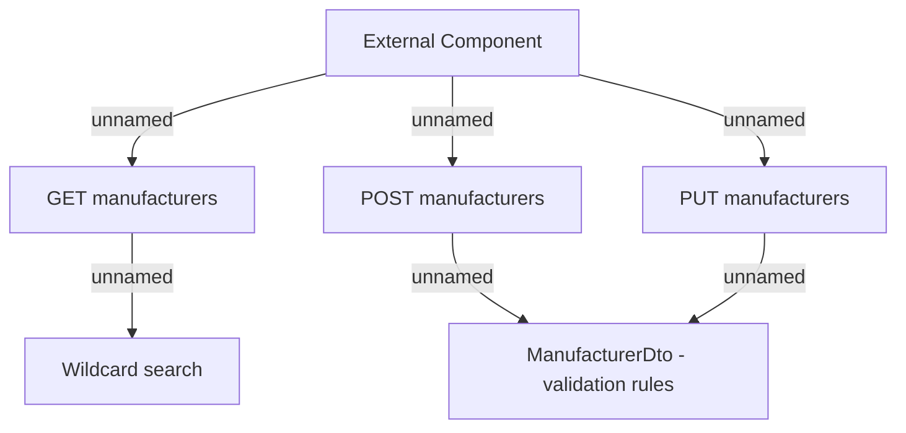

# Use Case

```mermaid
graph TD
    Wildcard_search["Wildcard search"]
    ManufacturerDto_validation_rules["ManufacturerDto - validation rules"]
    External_Component["External Component"]
    PUT_manufacturers["PUT manufacturers"]
    POST_manufacturers["POST manufacturers"]
    GET_manufacturers["GET manufacturers"]
    POST_manufacturers -->|unnamed| ManufacturerDto_validation_rules
    PUT_manufacturers -->|unnamed| ManufacturerDto_validation_rules
    GET_manufacturers -->|unnamed| Wildcard_search
    External_Component -->|unnamed| GET_manufacturers
    External_Component -->|unnamed| POST_manufacturers
    External_Component -->|unnamed| PUT_manufacturers
```
