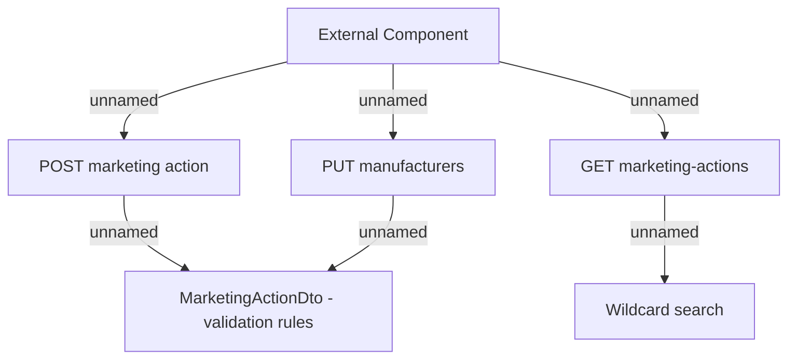

# Use Case

```mermaid
graph TD
    Wildcard_search["Wildcard search"]
    MarketingActionDto_validation_rules["MarketingActionDto - validation rules"]
    External_Component["External Component"]
    PUT_manufacturers["PUT manufacturers"]
    POST_marketing_action["POST marketing action"]
    GET_marketing_actions["GET marketing-actions"]
    POST_marketing_action -->|unnamed| MarketingActionDto_validation_rules
    PUT_manufacturers -->|unnamed| MarketingActionDto_validation_rules
    GET_marketing_actions -->|unnamed| Wildcard_search
    External_Component -->|unnamed| PUT_manufacturers
    External_Component -->|unnamed| GET_marketing_actions
    External_Component -->|unnamed| POST_marketing_action
```
