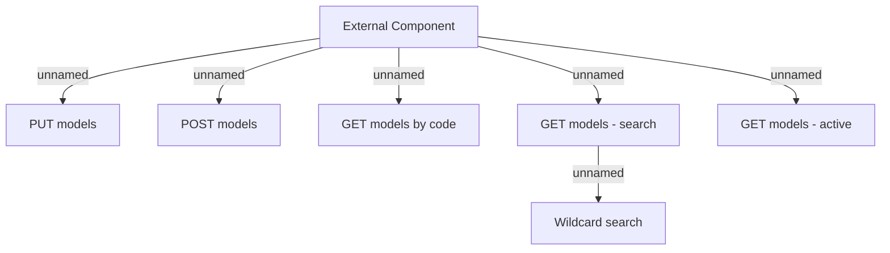

# Use Case

```mermaid
graph TD
    Wildcard_search["Wildcard search"]
    PUT_models["PUT models"]
    POST_models["POST models"]
    GET_models_by_code["GET models by code"]
    GET_models_search["GET models - search"]
    GET_models_active["GET models - active"]
    External_Component["External Component"]
    GET_models_search -->|unnamed| Wildcard_search
    External_Component -->|unnamed| PUT_models
    External_Component -->|unnamed| POST_models
    External_Component -->|unnamed| GET_models_active
    External_Component -->|unnamed| GET_models_by_code
    External_Component -->|unnamed| GET_models_search
```
