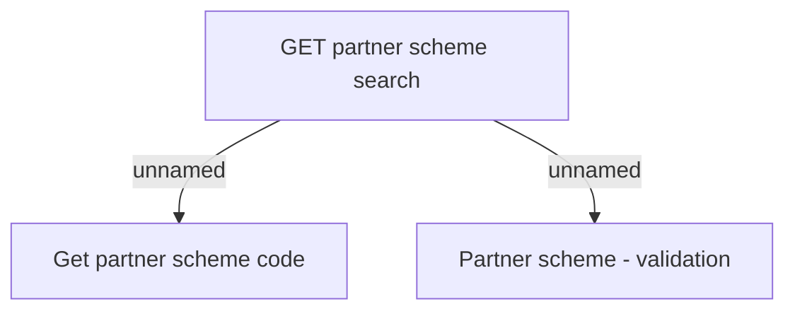

# Use Case

```mermaid
graph TD
    Get_partner_scheme_code["Get partner scheme code"]
    Partner_scheme_validation["Partner scheme - validation"]
    GET_partner_scheme_search["GET partner scheme search"]
    GET_partner_scheme_search -->|unnamed| Get_partner_scheme_code
    GET_partner_scheme_search -->|unnamed| Partner_scheme_validation
```
