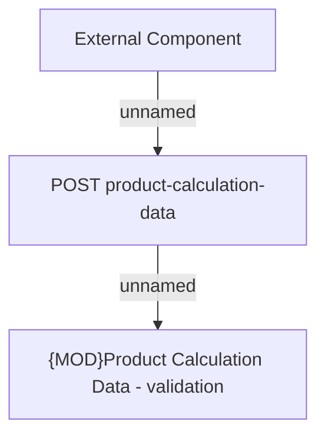

# Use Case

```mermaid
graph TD
    External_Component["External Component"]
    MOD_Product_Calculation_Data_validation["{MOD}Product Calculation Data - validation"]
    POST_product_calculation_data["POST product-calculation-data"]
    POST_product_calculation_data -->|unnamed| MOD_Product_Calculation_Data_validation
    External_Component -->|unnamed| POST_product_calculation_data
```
